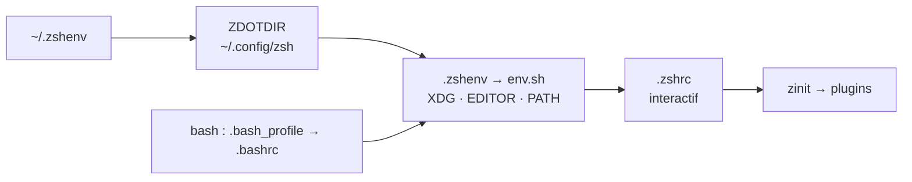

[](https://github.com/racongiu/dotfiles/actions/workflows/ci.yml)


Tout mon environnement de travail, versionné et reproductible : un seul
`./run install` amène un **macOS** neuf à un poste de travail prêt à
l'emploi.

<!-- TODO : capture d'écran : prompt starship, barre de statut tmux, sortie de `ll`.
     À enregistrer sous assets/preview.png, puis :  -->

> [!WARNING]
> Ce sont mes réglages. Lis avant de lancer.

## Prérequis

|        |                                                                 |
| ------ | --------------------------------------------------------------- |
| OS     | **macOS** pour l'installeur ; les configs, elles sont portables |
| Outils | `git`, `curl`                                                   |
| Accès  | une clé SSH sur GitHub, le clone utilise `git@`                 |
| `sudo` | deux étapes, et pas systématiquement                            |

<details>
<summary>Le détail de ces quatre lignes</summary>

`./run` teste `uname -s` et sort en 1 sur tout autre système, avec un message
qui le dit. Les configurations ne testent aucun OS : elles sondent ce qui est
présent (`command -v`, `[ -d ]`) et restent portables ailleurs.

`sudo` est demandé dans `prereqs`, parce que l'installeur Homebrew le réclame
lui-même, et dans `shell`, uniquement si le zsh de Homebrew n'est pas déjà
listé dans `/etc/shells` — `chsh` refuse un shell absent de ce fichier. Tout le
reste demeure dans `$HOME`.

</details>

## Stack

- **Shell** : zsh (shell de connexion) · bash
- **Prompt** : starship
- **Runtimes** : mise
- **Thème** : Catppuccin, clair/sombre automatique
- **Terminaux** : ghostty · kitty
- **Multiplexeur** : tmux
- **Éditeurs** : nvim · vim (fallback) · JetBrains

## Garanties

| Garantie                  | Ce que ça veut dire                                                                                                      |
| ------------------------- | ------------------------------------------------------------------------------------------------------------------------ |
| Installeur en POSIX sh    | idempotent, `--dry-run` fidèle, backups restaurables, codes de sortie honnêtes                                           |
| `$HOME` propre            | tout suit [XDG](https://specifications.freedesktop.org/basedir-spec/latest/), migration des anciens historiques comprise |
| Aucun root pour le shell  | `~/.zshenv` fait tout depuis `$HOME`                                                                                     |
| Dégradation propre        | pas de réseau, pas de git, un outil manquant : le shell démarre quand même                                               |
| L'outillage fait autorité | shellcheck et shfmt épinglés par le dépôt, imposés par lui                                                               |

**Non-objectifs** : aucun framework pour l'installeur, aucune installation
système ou multi-utilisateur, aucun support Linux ou Windows. `./run` refuse
plutôt que de deviner.

## Comment ça marche



Détails, ordre de chargement et décisions de conception :
[docs/architecture.md](docs/architecture.md).

## Organisation du dépôt

```text
.
├── run                  # l installeur
├── Brewfile             # la liste brew/cask, lue par l'étape packages
├── setup/               # ses entrailles
│   ├── manifest.sh      #   liens, dossiers, migrations
│   ├── lib/             #   log.sh, util.sh
│   ├── steps/           #   une responsabilité par fichier
│   └── commands/        #   install / update / upgrade
├── .config/             # tout ce qui est lié dans ~/.config
│   ├── zsh/ tmux/ git/  #   les trois qui portent le plus de mécanique
│   ├── ghostty/ kitty/  #   terminaux
│   └── nvim/            #   submodule racongiu/nvim
├── scripts/             # manuels, sur le PATH, jamais lancés par ./run
├── docs/                # architecture · installeur · sécurité
│                        # usage · outils · maintenance
├── .github/             # workflow de CI + Dependabot
├── .zshenv              # va dans $HOME : bootstrap de ZDOTDIR
├── .bashrc              # va dans $HOME
├── .bash_profile        # va dans $HOME
├── .vimrc               # va dans $HOME : vim de fallback, cinq options
├── .editorconfig        # autorité de formatage, lue par la CI
├── .yamllint.yml        # idem, pour le YAML
├── .gitignore           # exclusions du dépôt
├── .gitmodules          # déclare le submodule nvim
├── README.md            # ce fichier
└── LICENSE              # MIT
```

Dans `setup/` : [docs/installer.md](docs/installer.md).

## Démarrage rapide

```sh
git clone --recurse-submodules git@github.com:racongiu/dotfiles.git ~/.dotfiles
cd ~/.dotfiles
./run install
exec zsh
```

`./run install` est idempotent. Prévisualiser d'abord : `./run install -n`.

<details>
<summary>Machine neuve : pourquoi les clés viennent après</summary>

`ssh-keygen -K` est le seul moyen de redériver les clés depuis la YubiKey, et
celui de macOS ne sait pas parler aux clés FIDO2 : il répond `No FIDO
SecurityKeyProvider specified`. Celui qui sait vient de Homebrew, que
`./run install` pose. D'où l'ordre :

1. Le clone et l'installation ci-dessus. Le submodule passe du premier coup,
   son URL est en `git@`.
2. Les clés de la YubiKey, puis `./run install gitsign` :
   [docs/security.md](docs/security.md).

</details>

Ensuite, dans l'ordre :

| Quoi                   | Où                                                                  |
| ---------------------- | ------------------------------------------------------------------- |
| changer l'identité git | `.config/git/config`, versionné — [pourquoi](.config/git/README.md) |
| activer la signature   | [docs/security.md](docs/security.md), après l'installation          |

Sans YubiKey sur cette machine, il n'y a rien à faire : `gitsign` laisse la
signature désactivée et rien d'autre ne change.

## Commandes

| Commande        | Effet                                                                |
| --------------- | -------------------------------------------------------------------- |
| `./run install` | tout, jusqu'à prêt. Idempotent                                       |
| `./run update`  | `git pull`, puis resynchronise liens, paquets, runtimes, plugins     |
| `./run upgrade` | monte les versions : brew, mise, claude code, zinit, TPM, submodules |

Options : `-n`/`--dry-run`, `-y`/`--yes`, `-h`/`--help`.
Étapes isolées : `./run install symlinks packages`.

<details>
<summary>Installer sans root</summary>

Sauter les deux étapes qui demandent sudo :

```sh
./run install submodules directories migrate symlinks packages gitsign runtimes plugins
```

</details>

## Documentation

| Page                                    | Contenu                                                                                  |
| --------------------------------------- | ---------------------------------------------------------------------------------------- |
| [architecture.md](docs/architecture.md) | chaînes de démarrage, organisation XDG, bootstrap sans root, politique des plugins       |
| [installer.md](docs/installer.md)       | comment `run` fonctionne, contrat des étapes, backups                                    |
| [usage.md](docs/usage.md)               | tout ce qu'on tape : mode vi de zsh, fzf, fzf-git, alias                                 |
| [outils.md](docs/outils.md)             | d'où vient chaque outil, pourquoi il est là, ce que mise épingle                         |
| [maintenance.md](docs/maintenance.md)   | ce que la CI vérifie, et quoi faire quand quelque chose casse                            |
| [security.md](docs/security.md)         | clés, signature, secrets, privilèges, planchers de version — toute la sécurité, une page |
| [tmux](.config/tmux/README.md)          | tout tmux : raccourcis, thème, plugins (vit avec sa config)                              |
| [git](.config/git/README.md)            | mécanique de config.local, les deux identités, alias, valeurs par défaut notables        |

tmux et git sont documentés **à côté de leur config**, parce qu'ils portent une
mécanique qui ne saute pas aux yeux à la lecture des fichiers. Tout ce qui
relève de la machine entière va dans `docs/`.

## Licence

[MIT](LICENSE).
